## Grapher README

This Java application, **Grapher**, allows you to parse, manipulate, and visualize directed graphs. It utilizes the JGraphT library for graph manipulation and the JGraphX library for graph visualization.

### Features

1. **Parsing Graph from DOT File**
    - **Method:** `parseGraph(String filePath)`
    - **Description:** Parses a graph from a DOT file.
    - **Example:**
      ```java
      Grapher grapher = new Grapher();
      Graph<String, DefaultEdge> graph = grapher.parseGraph("path/to/your/graph.dot");
      ```

2. **Adding Nodes**
    - **Methods:** `addNode(String label)`, `addNodes(String[] labels)`
    - **Description:** Adds nodes to the graph.
    - **Example:**
      ```java
      grapher.addNode("A");
      grapher.addNodes(new String[]{"B", "C"});
      ```

3. **Adding Edges**
    - **Method:** `addEdge(String srcLabel, String dstLabel)`
    - **Description:** Adds directed edges between nodes.
    - **Example:**
      ```java
      grapher.addEdge("A", "B");
      ```

4. **Exporting Graph to DOT Format**
    - **Method:** `outputDOTGraph(String filePath)`
    - **Description:** Exports the graph in DOT format to a file.
    - **Example:**
      ```java
      grapher.outputDOTGraph("path/to/save/graph.dot");
      ```

5. **Exporting Graph as Image**
    - **Method:** `outputGraphics(String filePath)`
    - **Description:** Exports the graph as an image file (PNG format).
    - **Example:**
      ```java
      grapher.outputGraphics("path/to/save/graph.png");
      ```

6. **Generating Graph Information**
    - **Method:** `toString()`
    - **Description:** Generates a string containing graph information, including nodes and edges.
    - **Example:**
      ```java
      String graphInfo = grapher.toString();
      ```

7. **Writing Graph Information to File**
    - **Method:** `writeToFile(String filePath)`
    - **Description:** Writes graph information to a text file.
    - **Example:**
      ```java
      grapher.writeToFile("path/to/save/graphInfo.txt");
      ```
8. **Removing a Node**
   - **Method:** `removeNode(String label)`
   - **Description:** Removes a node from the graph.
   - **Example:**
   ```java
   grapher.removeNode("B");
   ```
9. **Removing multiple Nodes**
   - **Method:** `removeNodes(String[] labels)`
   - **Description:** Removes multiple nodes from the graph
   - **Example:**
   ```java
   String[] nodesToRemove1 = {"A", "B"};
   grapher.removeNodes(nodesToRemove1);
   ```
10 **Removing an Edge**
   - **Method:** `removeEdge(String srcLabel, String dstLabel)`
   - **Description:** Removes an edge from the graph.
   - **Example:**
   ```java
   grapher.removeEdge("A", "B");
   ```
11. **Searching for a path in the graph**
   - **Method:** `Path graphSearch(String src, String dst, Algorithm algo)`
   - **Description:** Finds a path from a source node to destination node in BFS or DFS as specified.
   - **Example:**
   ```java
   grapher.graphSearch("A", "E", Algorithm.BFS); 
   ```
12. **Parsing through the graph to get a random path from source to destination**
   - **Method:** `Grapher.Path randomWalkPath = grapher2.graphSearch("a", "h");`
   - **Description:** Outputs a random path from source to destination.
   - **Example:**
     ```java
     Grapher grapher2 = new Grapher();
     grapher2.setStrat(new RandomWalk(grapher2.parseGraph("src/main/resources/input2.dot")));
     Grapher.Path randomWalkPath = grapher2.graphSearch("a", "h");
     System.out.println(randomWalkPath);
     ```
### How to Run
1. Clone the repository - [Link](https://github.com/kavanvasani/CSE-464-2023-kvasani)
2. **Compile the Code:**
   ```bash
   mvn package
   ```

3. **Run Tests:**
   ```bash
   mvn test
   ```

### Refactor branch
1. Performing 5 refactors
    * Removing unused imports -  Unused imports have been removed in order to reduce some clutter in the code
    * Used a variable instead of a direct numerical value - Using the number 4 did not make it clear why 4 was used, giving 4 as a value to a variable helps understand the purpose because of the variable name
      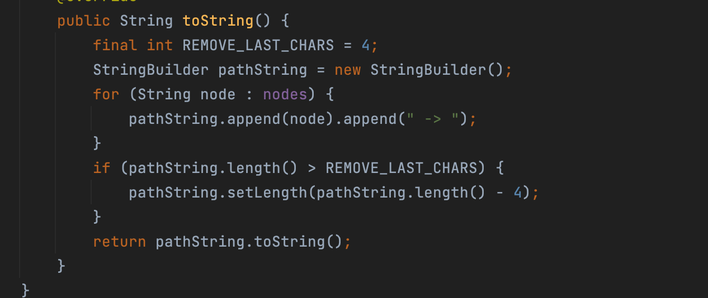
    * Used a variable instead of a direct value - Using the word PNG might not immediately make it clear why PNG was used, giving PNG as a value to a variable helps understand the purpose because of the variable name
      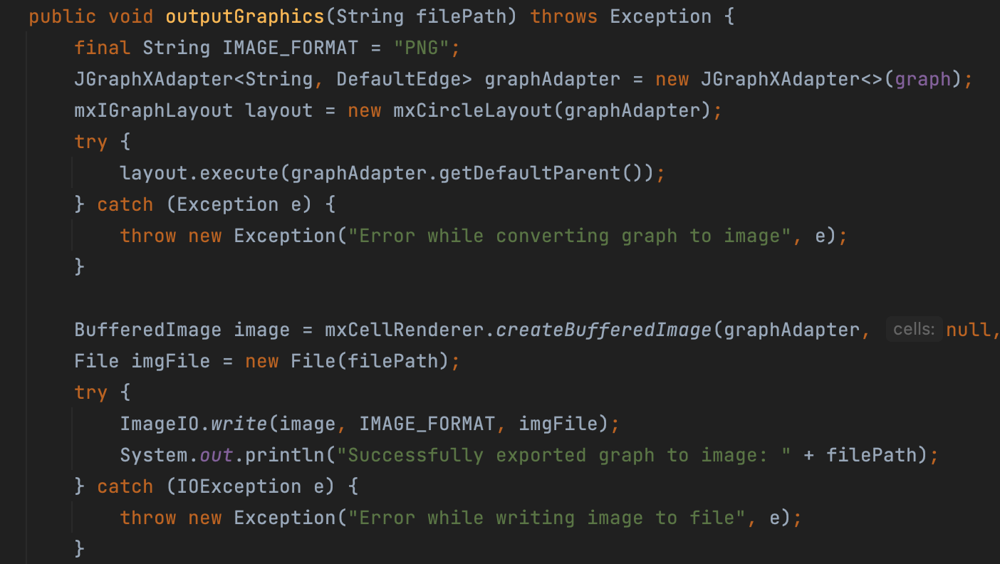
    * Modified testAddNode to show it handles duplicate node being added - There was no test case to see how duplicate node was handled in testAddNode
      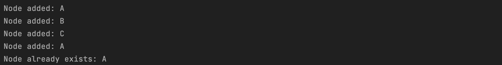
    * Modified testAddNodes to show it handles duplicate nodes being added - There was no test case to see how duplicate nodes were handled in testAddNode
      
2. Implementation of Template pattern
   * The Template Pattern is a design pattern that defines the skeleton of an algorithm in the superclass but lets subclasses override specific steps of the algorithm without changing its structure.
   * In this code, the GraphSearchTemplate class is the template. It provides the overall structure of a graph search algorithm but leaves specific steps (like getting edges, creating collections, and getting the next path) to be implemented by subclasses.
     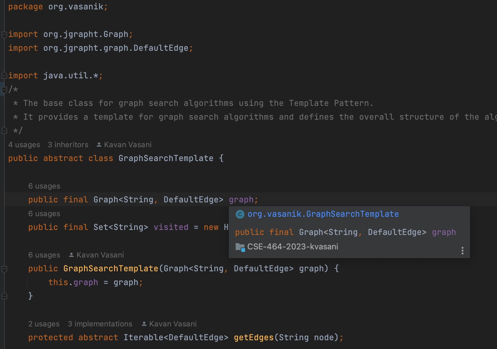
   * BFS, DFS and RandomWalk classes extend GraphSearchTemplate, providing implementations for the specific steps needed for Breadth-First Search, Depth-First Search and Random Walk respectively.
   * BFS uses a queue (LinkedList) for the collection, and DFS uses a stack.
3. Implementation of Strategy pattern
   * The Strategy Pattern is a behavioral design pattern that defines a family of algorithms, encapsulates each one, and makes them interchangeable. It allows the client to choose the appropriate algorithm at runtime.
   * The BFS and DFS classes extend GraphSearchTemplate, providing concrete implementations for the specific steps of Breadth-First Search and Depth-First Search, respectively.
   * The Grapher class has a member variable strat of type IGraphSearch, which represents the current strategy for graph search.
   * IGraphSearch interface defines the contract that all graph search algorithms must follow. It has a single method graphSearch for conducting the search and returning a path.
     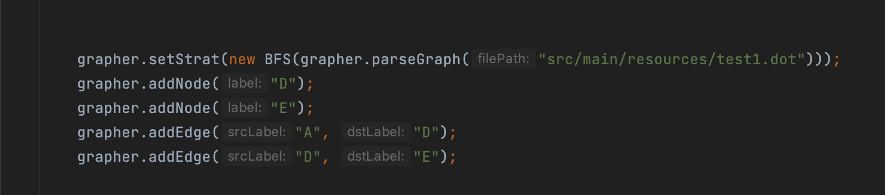
### Screenshots

- **Parsed Graph Information:**
  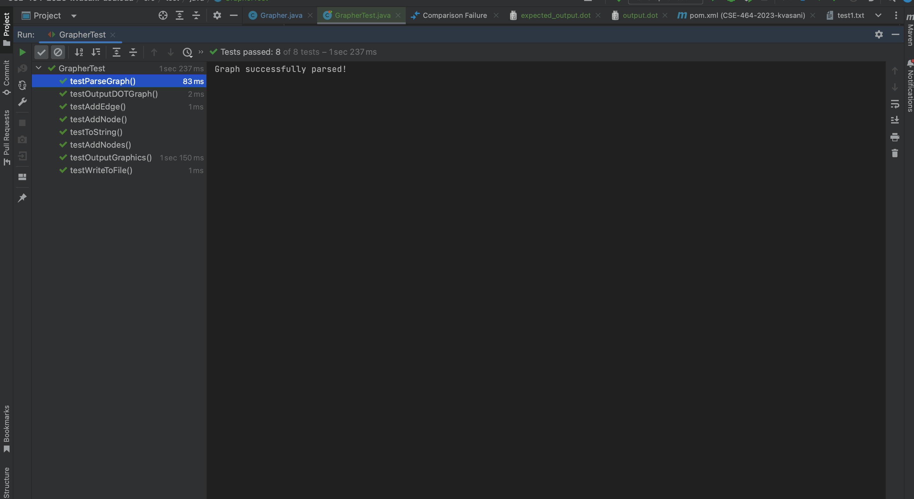

- **Exported Graph (DOT Format):**
  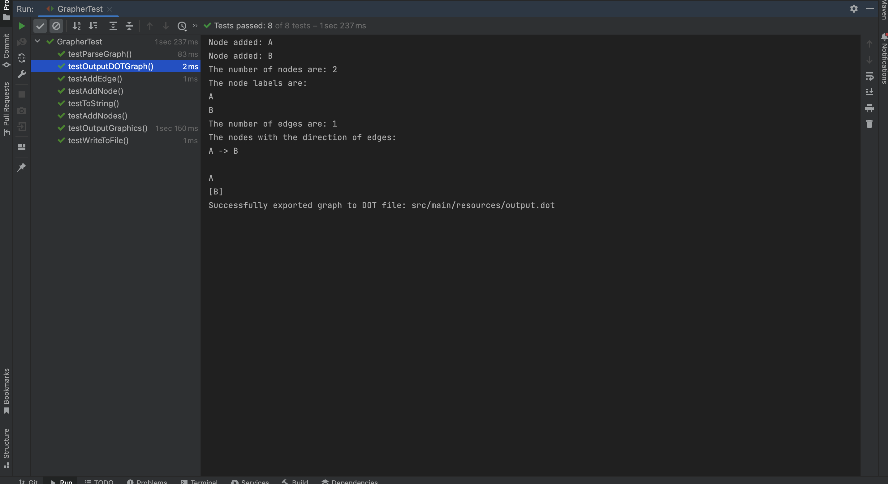

- **Exported Graph (Image):**
  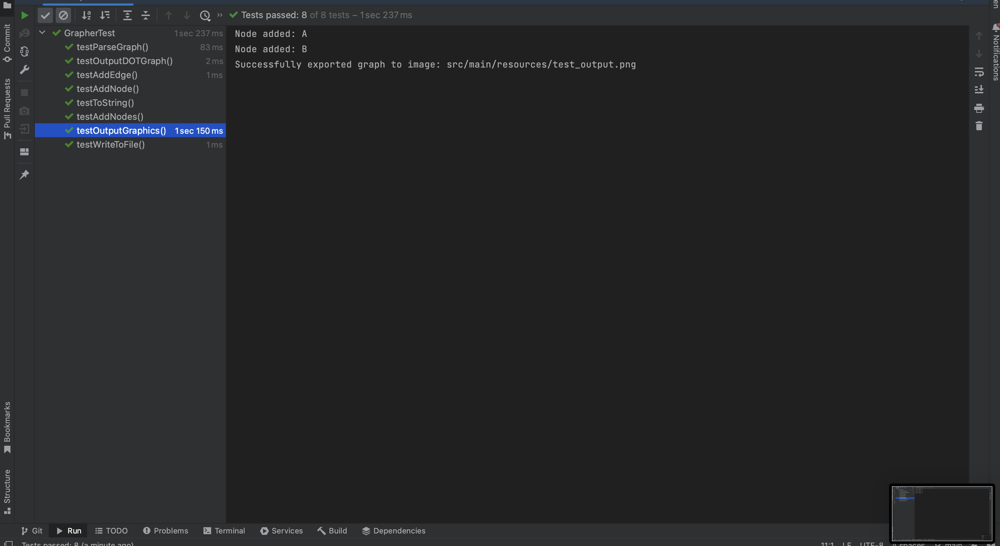
- **Exported Graph (Image):**
- 
- **Output to String:**
- 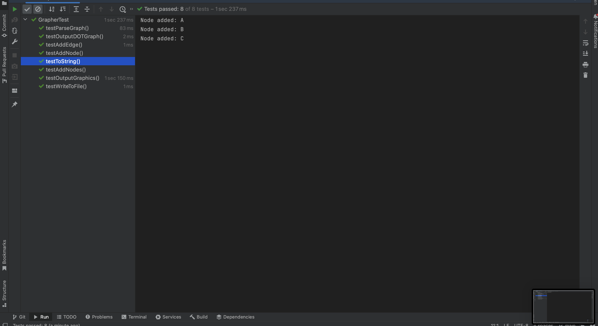
- **Adding list of nodes:**
- 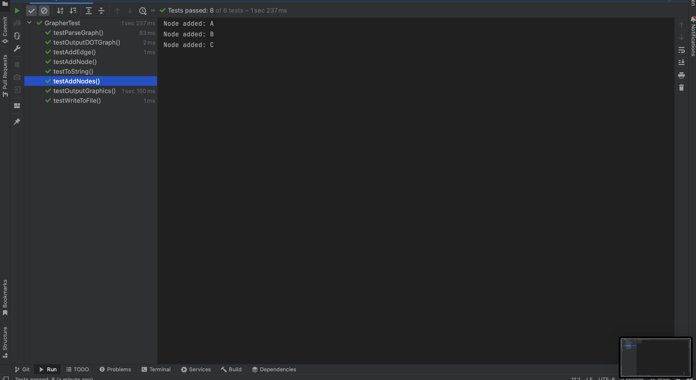
- **Added Edges:**
  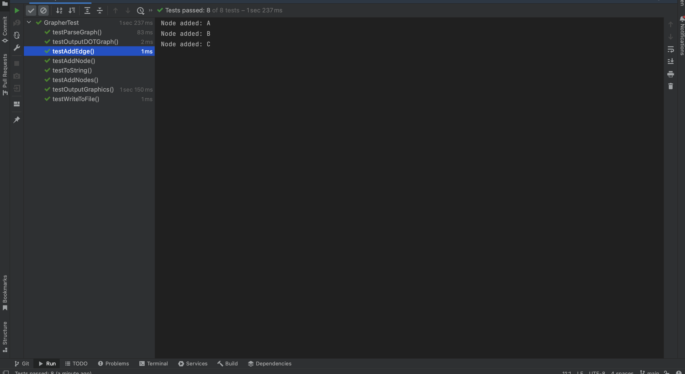
- **Added Node:**
  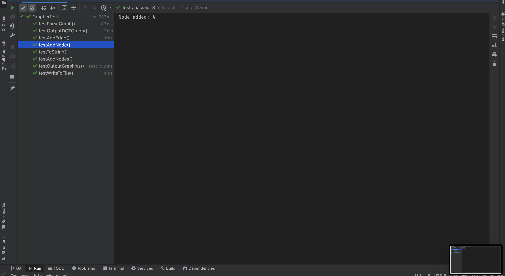
-  **Write Graph to text file:**
  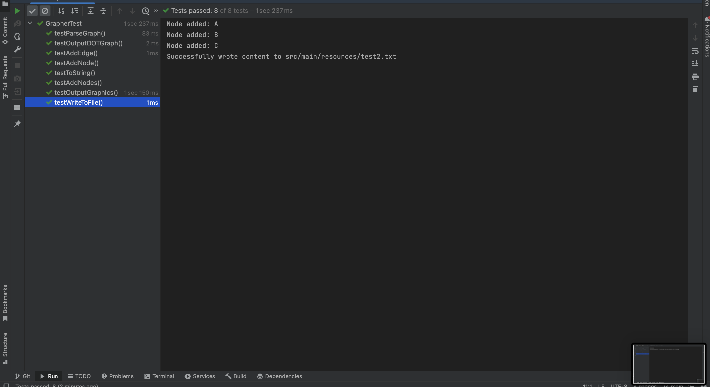
- **Remove a Node from the Graph:**
  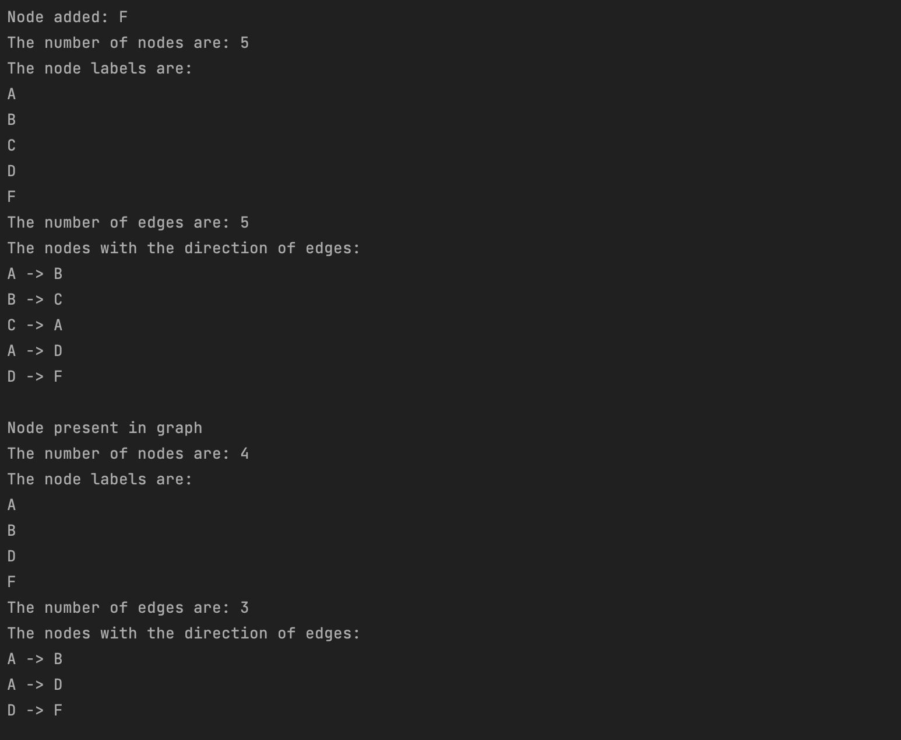
- **Remove multiple Nodes from the Graph:**
  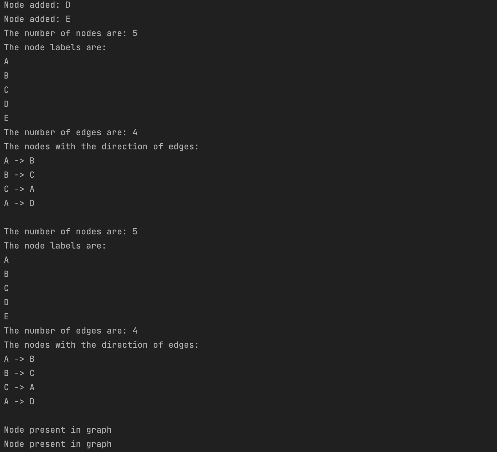
  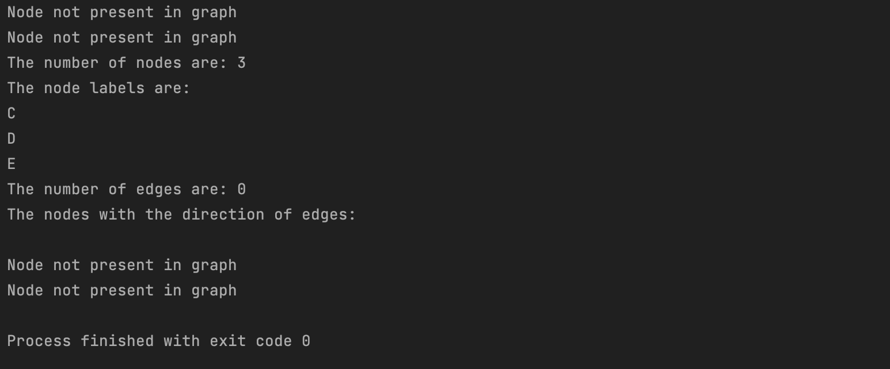
- **Created a BFS branch:**
  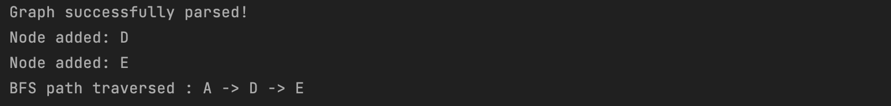
- **Created a DFS branch:**
  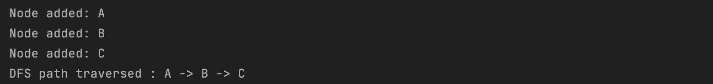
- **Searching for a path from source node to destination node (merged conflicts):**
  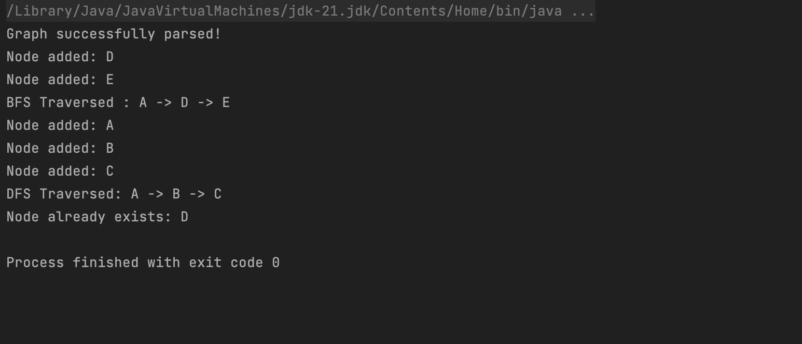
- **Implementing a random walk path from a source node to destination node**
  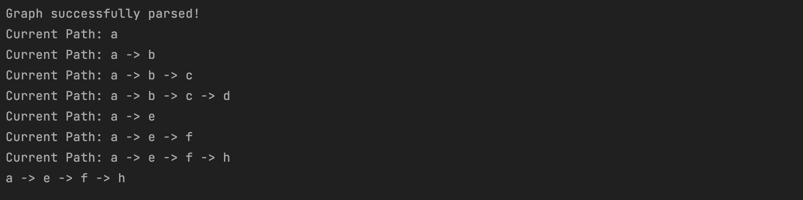
  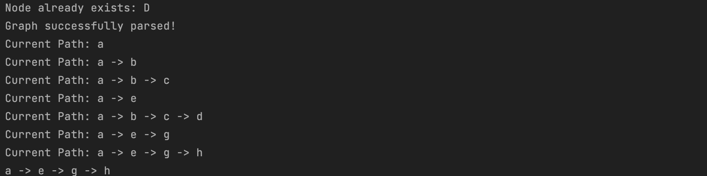

### Commits

- [Initial commit](https://github.com/kavanvasani/CSE-464-2023-kvasani/commit/09986fa52b53e2495035a9ea8c13edbffee8f4fa)
- [Built Maven. Also added feature 1](https://github.com/kavanvasani/CSE-464-2023-kvasani/commit/72b0230037f0ca6748fe958334fb456d1d6f1b98)
- [Finished feature 1. This commit outputs the graph and writes it to a text file.](https://github.com/kavanvasani/CSE-464-2023-kvasani/commit/845b9cefd6638e8f901f1cf50b72f14f30172881)
- [Finished feature 2. Node and list of nodes can now be added. The result is reflected in the output of the graph.](https://github.com/kavanvasani/CSE-464-2023-kvasani/commit/3356a96c73a61651afbb782063b4304bd9e273fe)
- [Finished Feature 3. The Edges are added to the graph and it is reflected when the graph is outputed.](https://github.com/kavanvasani/CSE-464-2023-kvasani/commit/aa3b246ec0f84151bd3e4c14fda5c6356057f13c)
- [Finished Feature 4. The graph is visible in the dot file and a png image is also formed to visualize the graph.](https://github.com/kavanvasani/CSE-464-2023-kvasani/commit/aa3b246ec0f84151bd3e4c14fda5c6356057f13c)
- [Added all the tests and the finishing touches](https://github.com/kavanvasani/CSE-464-2023-kvasani/commit/ae0d942416268f6f18614d3d5c62a4563227246f)
- [Added APIs for removing a node, removing multiple nodes and removing an edge](https://github.com/kavanvasani/CSE-464-2023-kvasani/commit/3e8d308ae0005bf52e7c23e5752c21f6e717ac6c)
- [Created maven.yml](https://github.com/kavanvasani/CSE-464-2023-kvasani/commit/4929bc77c749bfabdbcf546f1ee17731ac0f71f9)
- [Uncommented previous test cases](https://github.com/kavanvasani/CSE-464-2023-kvasani/commit/1eed3b7fa782d5ecf8fd5de056a5f4e371f9ba10)
- [Merged the maven into main](https://github.com/kavanvasani/CSE-464-2023-kvasani-asu.edu)
- [Added bfs branch](https://github.com/kavanvasani/CSE-464-2023-kvasani/commit/c94f33969c96cbfff6bba367a11dea67d612b773)
- [Added dfs branch](https://github.com/kavanvasani/CSE-464-2023-kvasani/commit/d910459fc4d441cf232def1620435946155f3a3c)
- [Merged conflicts between dfs and bfs branches](https://github.com/kavanvasani/CSE-464-2023-kvasani/commit/0770ce964a2b4653d9dc9ea1e20fcd1437f15eed)
- [Performed 5 refactorings in the code](https://github.com/kavanvasani/CSE-464-2023-kvasani/commit/1ef095fb1b5a1584d1ca332e3dd607130a0cb052)
- [Template pattern added for BFS and DFS](https://github.com/kavanvasani/CSE-464-2023-kvasani/commit/4401585d08702e856cb1f3a2909d8ed37e91c854)
- [Strategy pattern implemented for DFS BFS](https://github.com/kavanvasani/CSE-464-2023-kvasani/commit/bcff81a71607766a036c5b9f21d3c375a945e7cd)
- [Random walk implemented](https://github.com/kavanvasani/CSE-464-2023-kvasani/commit/ef9625c268515db63978bd93561ac4b87b7e4f94)
- [Added comments to explain project structure better](https://github.com/kavanvasani/CSE-464-2023-kvasani/commit/6cf8ae46813bed1036458b48dca8256ca8e1e1c5)
