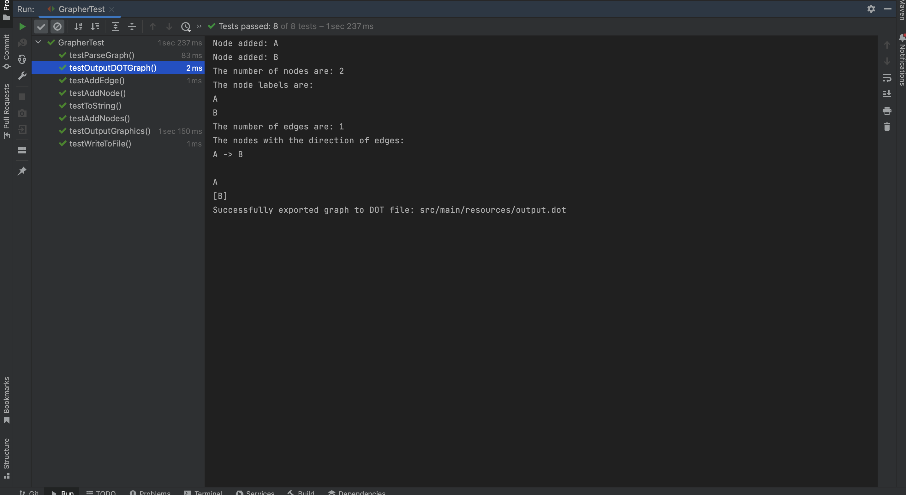
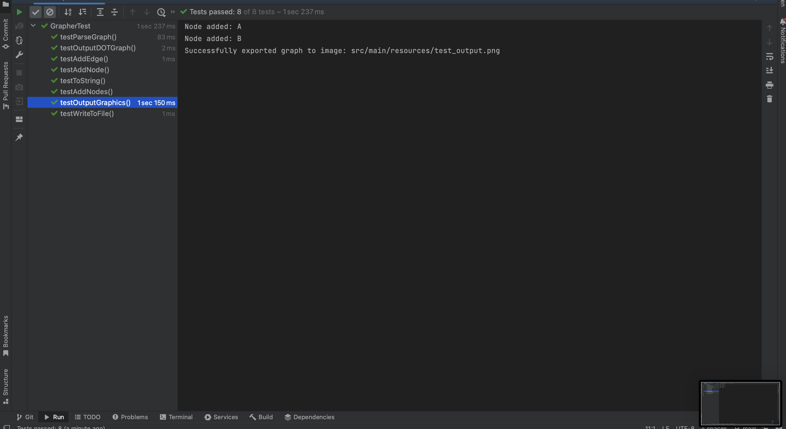
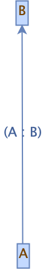
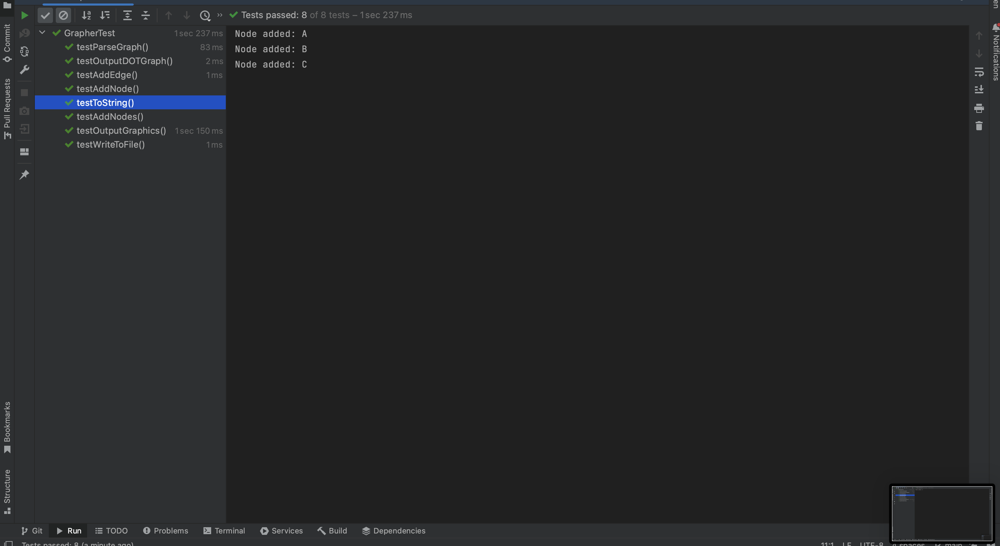
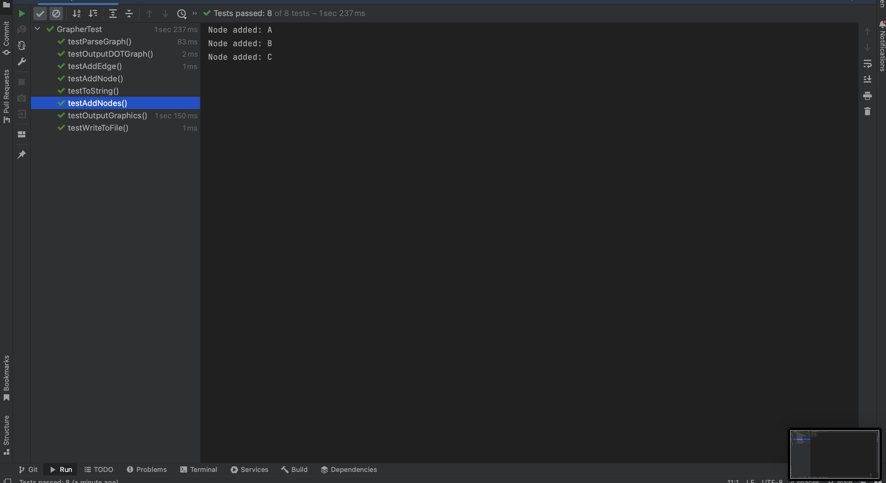
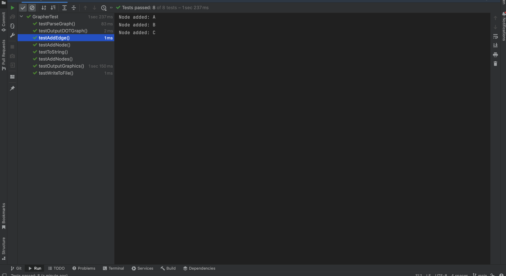
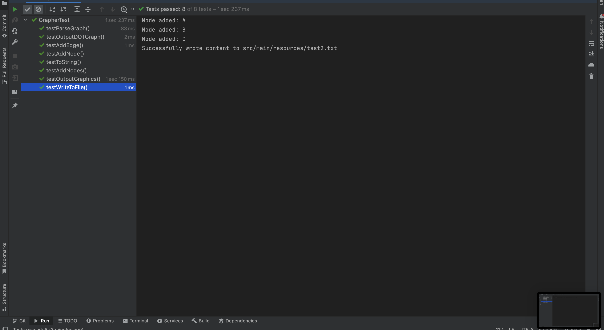

## Grapher README

This Java application, **Grapher**, allows you to parse, manipulate, and visualize directed graphs. It utilizes the JGraphT library for graph manipulation and the JGraphX library for graph visualization.

### Features

1. **Parsing Graph from DOT File**
    - **Method:** `parseGraph(String filePath)`
    - **Description:** Parses a graph from a DOT file.
    - **Example:**
      ```java
      Grapher grapher = new Grapher();
      Graph<String, DefaultEdge> graph = grapher.parseGraph("path/to/your/graph.dot");
      ```

2. **Adding Nodes**
    - **Methods:** `addNode(String label)`, `addNodes(String[] labels)`
    - **Description:** Adds nodes to the graph.
    - **Example:**
      ```java
      grapher.addNode("A");
      grapher.addNodes(new String[]{"B", "C"});
      ```

3. **Adding Edges**
    - **Method:** `addEdge(String srcLabel, String dstLabel)`
    - **Description:** Adds directed edges between nodes.
    - **Example:**
      ```java
      grapher.addEdge("A", "B");
      ```

4. **Exporting Graph to DOT Format**
    - **Method:** `outputDOTGraph(String filePath)`
    - **Description:** Exports the graph in DOT format to a file.
    - **Example:**
      ```java
      grapher.outputDOTGraph("path/to/save/graph.dot");
      ```

5. **Exporting Graph as Image**
    - **Method:** `outputGraphics(String filePath)`
    - **Description:** Exports the graph as an image file (PNG format).
    - **Example:**
      ```java
      grapher.outputGraphics("path/to/save/graph.png");
      ```

6. **Generating Graph Information**
    - **Method:** `toString()`
    - **Description:** Generates a string containing graph information, including nodes and edges.
    - **Example:**
      ```java
      String graphInfo = grapher.toString();
      ```

7. **Writing Graph Information to File**
    - **Method:** `writeToFile(String filePath)`
    - **Description:** Writes graph information to a text file.
    - **Example:**
      ```java
      grapher.writeToFile("path/to/save/graphInfo.txt");
      ```

### How to Run
1. Clone the repository - [Link](https://github.com/kavanvasani/CSE-464-2023-kvasani)
2. **Compile the Code:**
   ```bash
   mvn package
   ```

3. **Run Tests:**
   ```bash
   mvn test
   ```


### Screenshots

- **Parsed Graph Information:**
  

- **Exported Graph (DOT Format):**
  

- **Exported Graph (Image):**
  
- **Exported Graph (Image):**
- 
- **Output to String:**
- 
- **Adding list of nodes:**
- 
- **Added Edges:**
  
- **Added Node:**
  
-  **Write Graph to text file:**
  
### Commits

- [Initial commit](https://github.com/kavanvasani/CSE-464-2023-kvasani/commit/09986fa52b53e2495035a9ea8c13edbffee8f4fa)
- [Built Maven. Also added feature 1](https://github.com/kavanvasani/CSE-464-2023-kvasani/commit/72b0230037f0ca6748fe958334fb456d1d6f1b98)
- [Finished feature 1. This commit outputs the graph and writes it to a text file.](https://github.com/kavanvasani/CSE-464-2023-kvasani/commit/845b9cefd6638e8f901f1cf50b72f14f30172881)
- [Finished feature 2. Node and list of nodes can now be added. The result is reflected in the output of the graph.](https://github.com/kavanvasani/CSE-464-2023-kvasani/commit/3356a96c73a61651afbb782063b4304bd9e273fe)
- [Finished Feature 3. The Edges are added to the graph and it is reflected when the graph is outputed.](https://github.com/kavanvasani/CSE-464-2023-kvasani/commit/aa3b246ec0f84151bd3e4c14fda5c6356057f13c)
- [Finished Feature 4. The graph is visible in the dot file and a png image is also formed to visualize the graph.](https://github.com/kavanvasani/CSE-464-2023-kvasani/commit/aa3b246ec0f84151bd3e4c14fda5c6356057f13c)
- [Added all the tests and the finishing touches](https://github.com/kavanvasani/CSE-464-2023-kvasani/commit/ae0d942416268f6f18614d3d5c62a4563227246f)
